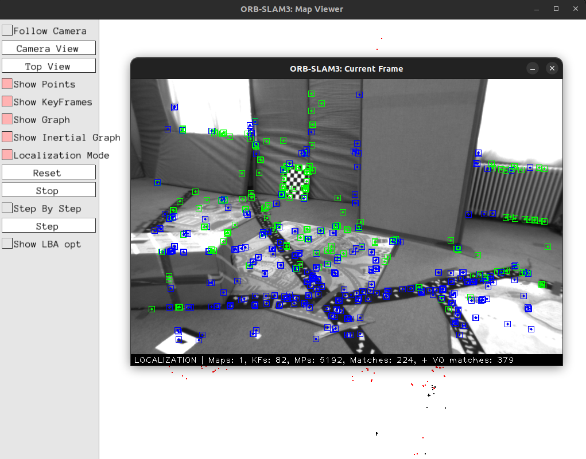
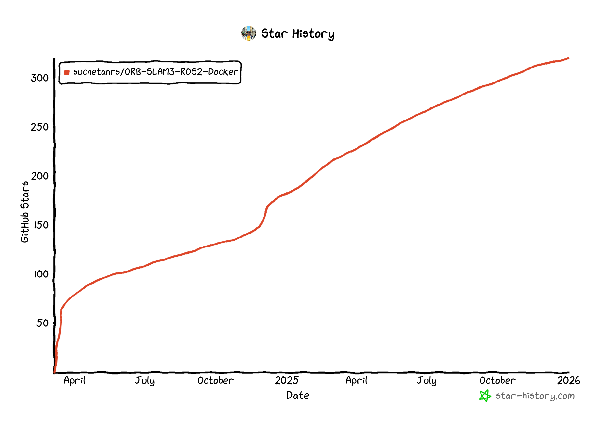

# ORB-SLAM3 ROS2 Wrapper Docker

This repository contains a dockerized comprehensive wrapper for ORB-SLAM3 on ROS 2 Humble for Ubuntu 22.04.

# Important Note:

Please use the `Release 1.0.0` version of this repository for the latest stable version. The `master` has the latest features but can be unstable and hasn't been tested extensively.

## Build status


# Demo GIF


# Building ORB_SLAM3

## 1. Clone this repository

1. ```git clone https://github.com/suchetanrs/ORB-SLAM3-ROS2-Docker```
2. ```cd ORB-SLAM3-ROS2-Docker```
3. ```git submodule update --init --recursive --remote```

## 2. Install Docker on your system

```bash
cd ORB-SLAM3-ROS2-Docker
sudo chmod +x container_root/shell_scripts/docker_install.sh
./container_root/shell_scripts/docker_install.sh
```

## 3. Build the image with ORB_SLAM3

1. Build the image: ```sudo docker build --build-arg USE_CI=false -t orb-slam3-humble:22.04 .```
2. Add `xhost +` to your `.bashrc` to support correct X11-forwarding using ```echo "xhost +" >> ~/.bashrc```
3. ```source ~/.bashrc```
4. You can see the built images on your machine by running ```sudo docker images```.

### To build NVIDIA CUDA version:

Replace step 1. with ```sudo docker build --build-arg USE_CI=false --build-arg TARGET=nvidia_gpu -t orb-slam3-humble-nvidia:22.04 .```

## 4. Running the container

1. ```cd ORB-SLAM3-ROS2-Docker``` (ignore if you are already in the folder)
2. ```sudo docker compose run orb_slam3_22_humble```
3. This should take you inside the container. Once you are inside, run the command ```xeyes``` and a pair of eyes should pop-up. If they do, X11 forwarding has correctly been setup on your computer.

### To run the NVIDIA CUDA version:

Replace step 2. with ```sudo docker compose run orb_slam3_22_nvidia```

## 5. Building the ORB-SLAM3 Wrapper

Launch the container using steps in (4).
```bash
cd /home/orb/ORB_SLAM3/ && sudo chmod +x build.sh && ./build.sh
cd /root/colcon_ws/ && colcon build --symlink-install && source install/setup.bash
```

### To build with CUDA:

Launch the container using steps in (4).
```bash
cd /home/orb/ORB_SLAM3/ && sudo chmod +x build.sh && ./build.sh
cd /root/colcon_ws/ && rm -rf build && colcon build --symlink-install --cmake-args -DORB_SLAM3_ROS2_WRAPPER_ENABLE_CUDA=ON && source install/setup.bash
```

# Launching ORB_SLAM3

This repository supports the following ways to test different configurations. <br>

To try the `mono`, `mono_imu`, `stereo`, `stereo_imu` setups, please refer to the `Running with the Euroc Dataset` below.

To try the `rgbd`, `rgbd_imu` setups, please refer to the `Running with Gazebo sim simulation` section below.

The launch files to test each configuration is in `orb_slam3_ros2_docker/launch` <br>
The default parameters in each of these launch files correspond to the following table. 

| Mode | EuRoC Dataset | Gazebo Simulation |
|------|---------------|-------------------|
| mono | ✅ | ❌ |
| mono_imu | ✅ | ❌ |
| rgbd | ❌ | ✅ |
| rgbd_imu | ❌ | ✅ |
| stereo | ✅ | ❌ |
| stereo_imu | ✅ | ❌ |

Launch the container using steps in (4). <br>
If you are inside the container, run the following:

1. ```ros2 launch orb_slam3_ros2_wrapper unirobot.launch.py sensor_config:=<replace_with_your_config>```
2. You can adjust the robot namespace in the ```unirobot.launch.py``` file.

`sensor_config` argument can take the following `mono`, `mono_imu`, `stereo`, `stereo_imu`, `rgbd`, `rgbd_imu`

## Running this with the Euroc dataset

Supported modes are `mono`, `mono_imu`, `stereo`, `stereo_imu`

1. Download the euroc dataset (outside the container) `sudo chmod +x download_euroc.sh && ./download_euroc.sh`
2. Open a new instance of the container you launched in (4) using `docker exec -it <container_id> bash`
3. `ros2 bag play colcon_ws/src/orb_slam3_ros2_wrapper/datasets/V1_01_easy`

Once the rosbag is playing, you should be able to run it with the wrapper in parallel.

## Running this with a Gazebo Sim simulation.

Supported modes are `rgbd`, `rgbd_imu`

1. Setup the ORB-SLAM3 ROS2 Docker using the steps above. Once you complete step (1) in the ```Launching ORB-SLAM3``` section, you should see a window popup which is waiting for images. This is partially indicative of the setup correctly done.
2. Setup the simulation by following the README [here (humble)](https://github.com/suchetanrs/gz-sim-environment/tree/humble) (recommended) or [here (jazzy)](https://github.com/suchetanrs/gz-sim-environment/tree/jazzy)
3. Once you are able to teleop the robot, you should be able to run ORB-SLAM3 with both the containers (simulation and wrapper) running in parallel.

## Running the map_generator package.

This package can be used to generate a global pointcloud from the SLAM.
It subscribes to the published `map_data` and an input pointcloud either from a LiDAR or from a depth camera. It stitches the input pointclouds together based on the latest pose-graph data.

To run the package, these steps can be followed:
1. Make sure the simulation is running. Run the orb_slam3 container and once you are in the bash shell, run the following: `./launch_slam.sh`
2. The top-left terminal contains the launch file to run the slam. This must be launched first.
3. The bottom-left terminal contains the launch file to start the pointcloud_stitcher node. This should run soon after you launch the SLAM.
4. If you wish to publish the global pointcloud at any point during the SLAM's operation, simply run the python file in the top-right terminal. You should be able to view the global pointcloud in rviz (you can launch RViz with the correct configuration from the bottom-right terminal).

# Localization only mode

To run this package in localization only mode, first map the environment and save the atlas.

## Map the environment and save the atlas

Navigate to `orb_slam3_ros2_docker/params/orb_slam3_params` and choose the param file corresponding to your desired sensor configuration. <br>
At the end of the file, append the following

```yaml
System.SaveAtlasToFile: ./my_atlas
```
Once done mapping, to save the atlas, press `ctrl+c` only once. Wait for the program to clean up completely. Saving the map might take some time. 

## Relaunch ORB_SLAM3 with pre-loaded map

Navigate to `orb_slam3_ros2_docker/params/orb_slam3_params` and choose the param file corresponding to your desired sensor configuration. <br>
At the end of the file, remove the parameter used for saving the atlas and append the following

```yaml
System.LoadAtlasFromFile: ./my_atlas
```

You should see the keyframes in the viewer. Select `Localization mode` in the GUI of ORB_SLAM3.<br>
Then play the bag file. The following should be the result. The blue features represent VIO. The green features are matched with the underlying saved atlas. <br>



### Potential issues you may face.
The simulation and the wrapper both have their ```ROS_DOMAIN_ID``` set to 55 so they are meant to work out of the box. However, you may face issues if this environment variable is not set properly. Before you start the wrapper, run ```ros2 topic list``` and make sure the topics `/rgb_camera` and `/depth_camera` are visible inside the ORB-SLAM3 container provided the simulation is running alongside.

## Services
| Service Name          | Purpose | Type |
|-------------------------|---------------|---------------|
| `orb_slam3/get_map_data`      | Sends the map_data in the response. | `slam_msgs::srv::GetMap` |
| `orb_slam3/get_landmarks_in_view`      | Takes an input pose and publishes the feature points visible from that pose. | `slam_msgs::srv::GetLandmarksInView` |
| `orb_slam3/get_all_landmarks_in_map`      | Publishes all feature points in the map and fills the same pointcloud in the response. | `slam_msgs::srv::GetAllLandmarksInMap` |
| `orb_slam3/reset_mapping`      | Resets the current mapping instance and clears all keyframes. | `std_srvs::srv::SetBool` |

## Published Topics
| Topic Name          | Purpose | Type |
|-------------------------|---------------|---------------|
| `map_points`            | Publishes the point cloud representing feature points collected from the SLAM process. This is published when `orb_slam3/get_all_landmarks_in_map` service is called.             | `sensor_msgs::msg::PointCloud2` |
| `visible_landmarks`     | Publishes the point cloud of feature points (landmarks) visible from a given pose. This is published when `orb_slam3/get_landmarks_in_view` service is called.                  | `sensor_msgs::msg::PointCloud2` |
| `slam_info`             | Publishes overall SLAM-related information.          | `slam_msgs::msg::SlamInfo`      |
| `map_data`              | Continuously publishes the map data generated by the SLAM algorithm.                               | `slam_msgs::msg::MapData`       |
| `robot_pose_slam`       | Publishes the robot's pose expressed in the global frame.                                        | `geometry_msgs::msg::PoseStamped` |

## ROS Parameters
| Parameter Name          | Default Value | Description                                                                 |
|-------------------------|---------------|-----------------------------------------------------------------------------|
| `robot_base_frame`      | `base_footprint` | The name of the frame attached to the robot's base. |
| `global_frame`          | `map`         | The name of the global frame of reference. It represents a fixed world coordinate frame in which the robot navigates.|
| `odom_frame`            | `odom`        | The name of the odometry frame. |
| `rgb_image_topic_name` | `rgb_camera` | The topic to receive rgb images. |
| `depth_image_topic_name` | `depth_camera` | The topic to receive depth images. |
| `imu_topic_name` | `imu` | The topic to receive IMU messages (Not used in RGB-D mode). |
| `visualization`         | `true`        | A boolean flag to enable or disable visualization. When set to `true`, the ORB-SLAM3 viewer will show up with the tracked points and the keyframe trajectories.|
| `odometry_mode`      | `false`       | A boolean flag to toggle odometry mode. When `false`, the system operates without relying on odometry data, which might be used in scenarios where odometry information is unavailable or unreliable. In this case, it publishes the transform directly between the ```global_frame``` and the ```robot_base_frame```. Further information can be found on the [FAQ](https://github.com/suchetanrs/ORB-SLAM3-ROS2-Docker/wiki/FAQs)|
| `publish_tf`               | `true`         | Publishes the map->odom tf in case `odometry_mode` is set to `true` and map->odom->base_link in case odometry_mode is set to `false`. Further information can be found on the [FAQ](https://github.com/suchetanrs/ORB-SLAM3-ROS2-Docker/wiki/FAQs)|
| `map_data_publish_frequency`| `1000`         | Time interval at which map_data should be published (ms).|
| `do_loop_closing`| `true`         | Enable or disable loop closing in ORB-SLAM3. This will also disable re-localisation and multi-map if `false`|

## Important notes

ORB-SLAM3 is launched from ```orb_slam3_ros2_wrapper/launch/rgbd.launch.py``` which in turn is launched from ```orb_slam3_ros2_wrapper/launch/unirobot.launch.py```

Currently the ```rgbd.launch.py``` launch file defaults to ```orb_slam3_ros2_wrapper/params/gazebo_rgbd.yaml```. You can modify this with your own parameter file in case you wish to use your own camera.

The very initial versions of this code were derived from [thien94/orb_slam3_ros_wrapper](https://github.com/thien94/orb_slam3_ros_wrapper) and [zang9/ORB_SLAM3_ROS2](https://github.com/zang09/ORB_SLAM3_ROS2)

# Star history


